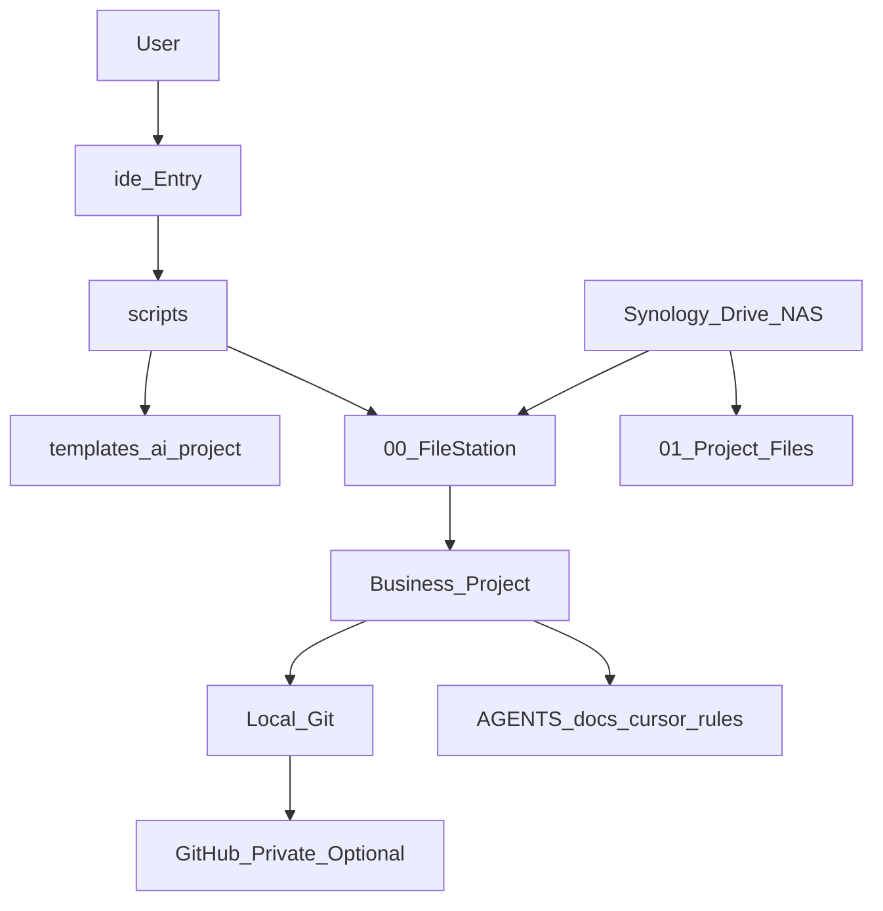
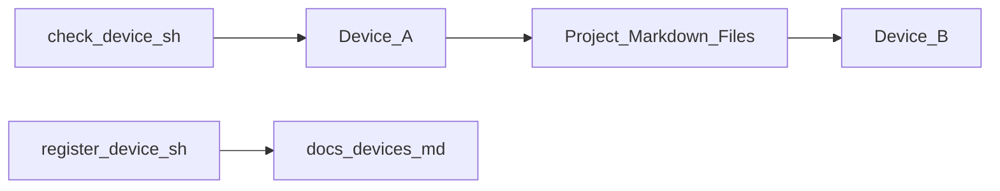

# 系统架构

## 定位

ide-toolbox（IDE Toolbox）不是业务项目目录，而是 Cursor/Codex 多端项目的**自动化工具箱**。



## 四层分工

| 层级 | 载体 | 职责 |
|---|---|---|
| 文件同步层 | Synology Drive / NAS | 活动文件同步、备份 |
| 项目主线层 | Git + GitHub private | 代码、规则、Agent 上下文 |
| 执行层 | Cursor / Codex | 编码、长跑 Agent、对话 |
| 治理层 | ide-toolbox（IDE Toolbox） | 新建、升级、体检、归档、设备登记 |

**原则**：不要把 Cursor/Codex 聊天记录当作项目唯一记忆； durable 内容写入项目文件。

## 目录结构

```text
ide-toolbox/
├── ide                    # 单一入口（推荐）
├── README.md              # 用户总入口
├── AGENTS.md              # Agent 启动规则
├── automation-playbook.md # 日常操作
├── storage-policy.md      # 存储策略
├── projects-index.md      # 项目台账
├── config/
│   └── project-policy.yaml
├── docs/                  # 本文档目录
├── scripts/               # 自动化脚本
├── templates/
│   └── ai-project/        # 新业务项目模板
└── .cursor/rules/         # 工具箱自身 Cursor 规则
```

业务项目创建在：

```text
/Volumes/home/Drive/00_FileStation/YYMMDD-project-name/
```

归档在：

```text
/Volumes/home/Drive/01_Project Files/99_归档/
```

## 核心流程

### 新建项目


### 升级旧项目


### 多端接力



- **设备接入检查**：当前设备环境是否就绪
- **项目设备登记**：项目被哪些设备以什么路径使用

这不是 Git pull 设备列表。

## 隐私策略

| Profile | GitHub | 典型场景 |
|---|---|---|
| `code` | 可选 private | 普通代码 |
| `knowledge` | 默认 none | 知识库 |
| `private-local` | 禁止 | 求职/签证/证件 |
| `automation` | 可选 private | 脚本工具 |

## 安全默认

- 默认不创建 GitHub、不 push
- 归档默认 dry-run
- 批量升级默认 dry-run
- 不自动安装 `gh` 或其他依赖
- 高风险操作需确认或显式参数

## 与业务项目模板的关系

工具箱通过 `templates/ai-project/` 为新项目注入：

- `AGENTS.md`
- `.cursor/rules/ai-agent-workflow.mdc`
- `docs/ai-context.md`
- `docs/runbook.md`
- `docs/conversation-reuse.md`
- `docs/devices.md`
- `.gitignore`

业务项目的 Agent 上下文由这些文件承载，而非聊天历史。
