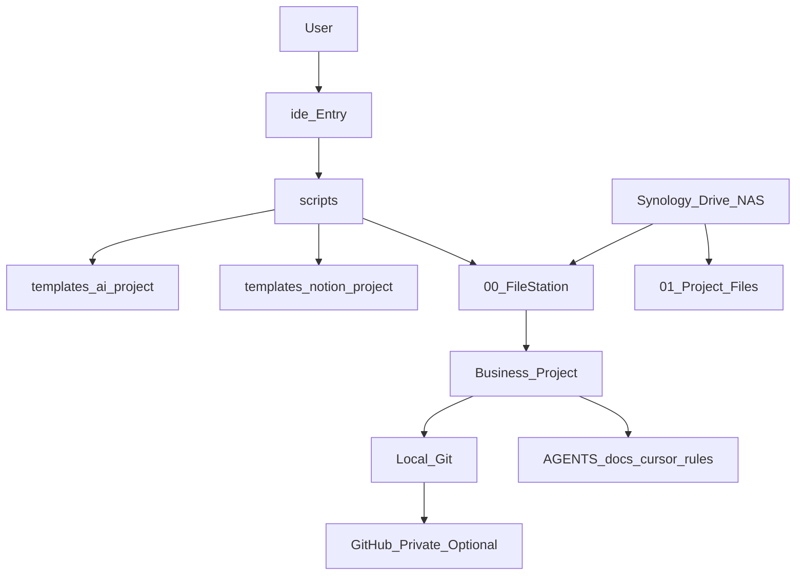
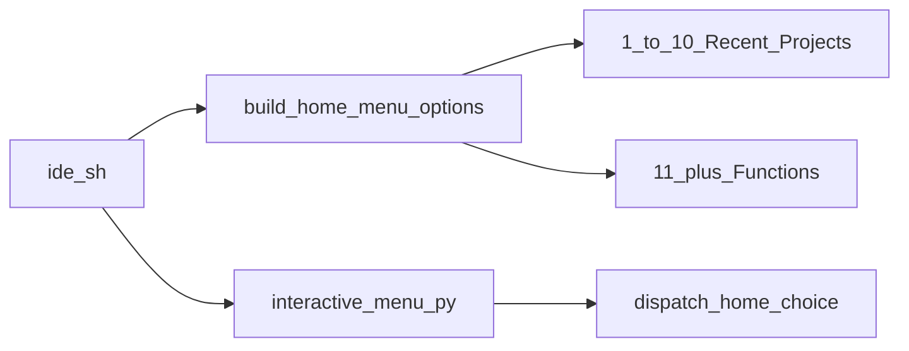
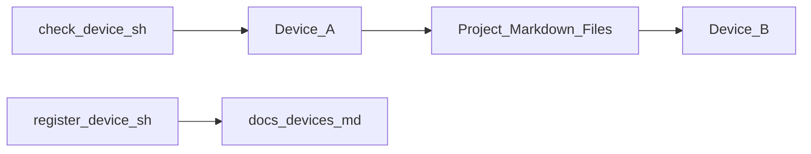

# 系统架构

## 定位

ide-toolbox（IDE Toolbox）不是业务项目目录，而是 Cursor/Codex 多端项目的**自动化工具箱**。



## 四层分工

| 层级 | 载体 | 职责 |
|---|---|---|
| 文件同步层 | Synology Drive / NAS | 活动文件同步、备份 |
| 项目主线层 | Git + GitHub（可选 private） | 代码、规则、Agent 上下文 |
| 执行层 | Cursor / Codex | 编码、长跑 Agent、对话 |

**Cursor / Codex 分工**：Cursor 靠 `.cursor/rules` 自动加载项目规则；Codex 靠用户级规则（见 `docs/codex-user-rule-template.md`）+ 项目内 `AGENTS.md` / `docs/codex-handoff.md`。文件记忆层两边共用。

| 治理层 | ide-toolbox（IDE Toolbox） | 新建、升级、体检、归档、设备登记 |

**原则**：不要把 Cursor/Codex 聊天记录当作项目唯一记忆； durable 内容写入项目文件。

## 目录结构

```text
ide-toolbox/
├── ide                         # 单一入口（推荐）
├── README.md / README.html     # 文本 / 可视化总览
├── AGENTS.md
├── automation-playbook.md
├── storage-policy.md
├── projects-index.md
├── config/project-policy.yaml  # 路径、设备、recent_projects
├── docs/
├── scripts/
│   ├── ide.sh                  # 主菜单 dispatch_home_choice
│   ├── lib.sh                  # list_recent_projects 等
│   └── interactive-menu.py   # 方向键 / 数字+回车 UI
├── templates/
│   ├── ai-project/             # 多端 AI 项目
│   └── notion-project/         # Notion 双轨维护项目
└── .cursor/rules/
```

业务项目创建在（各设备推荐路径见 `storage-policy.md`）：

```text
MacBook:  ~/Library/CloudStorage/SynologyDrive-FileStation/YYMMDD-project-name/
Mac mini: /Volumes/home/Drive/00_FileStation/YYMMDD-project-name/
Windows:  C:/Users/13555/SynologyDrive/YYMMDD-project-name/
```

### 多端路径策略（推荐）

| 设备 | 00 活动区 | 归档 01 |
|---|---|---|
| MacBook | Synology Drive 同步 | NAS 挂载（需要时） |
| Windows | Synology Drive 同步 | 通常未同步，在家设备操作 |
| Mac mini | NAS 挂载 | NAS 挂载 |

配置落在 `config/project-policy.yaml` → `devices.*`；脚本经 `resolve_active_dir` 解析。

归档在：

```text
/Volumes/home/Drive/01_Project Files/99_归档/
```

## 核心流程

### `./ide` 主菜单



- **1–10**：快速打开最近项目（`recent_projects.limit=5`，`max_age_days=7`）
- **11+**：新建 / 体检 / 归档等功能（显示为 `[11]`、`[12]`…）

### 新建项目


### 升级旧项目


### 多端接力



- **设备接入检查**：当前设备环境是否就绪
- **项目设备登记**：项目被哪些设备以什么路径使用

这不是 Git pull 设备列表。

## 隐私策略

| Profile | GitHub | 典型场景 |
|---|---|---|
| `code` | 可选 private | 普通代码 |
| `knowledge` | 默认 none | 知识库 |
| `private-local` | 禁止 | 求职/签证/证件 |
| `automation` | 可选 private | 脚本工具 |

## 安全默认

- 默认不创建 GitHub、不 push
- 归档默认 dry-run
- 批量升级默认 dry-run
- 不自动安装 `gh` 或其他依赖
- 高风险操作需确认或显式参数

## 与业务项目模板的关系

### `templates/ai-project/`（`--type code|docs|knowledge|automation`）

- `AGENTS.md`
- `.cursor/rules/ai-agent-workflow.mdc`
- `docs/ai-context.md`
- `docs/runbook.md`
- `docs/conversation-reuse.md`
- `docs/codex-handoff.md`
- `docs/devices.md`
- `.gitignore`

### `templates/notion-project/`（`--type notion-sync`）

在 AI 多端治理之上增加 Notion 双轨层：

- `manifest.yaml`、`NOTION_INDEX.md`
- `docs/HANDOFF.md`、`docs/notion-sync-policy.md`
- `data/*.csv` 任务镜像

默认隐私 `knowledge`、禁止 GitHub。Cursor 项目规则默认未内置，可用 `upgrade-ai-project.sh` 补缺失的多端文件（不覆盖 Notion 专用文件）。

业务项目的 Agent 上下文由这些文件承载，而非聊天历史。
