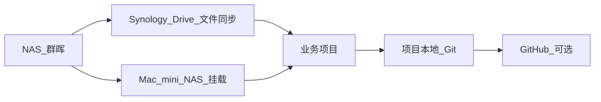

# NAS / Drive 存储策略

## 总体原则

- NAS 负责文件存放、同步、备份
- 项目内 Git（+ 可选 GitHub）负责代码与 Agent 上下文版本
- Cursor/Codex 负责执行
- `ide-toolbox`（IDE Toolbox）负责项目创建与治理

## 推荐多端策略（已落地）

| 设备 | `00_FileStation` 访问方式 | 原因 |
|---|---|---|
| **MacBook** | Synology Drive 同步 | 与 Windows 统一；外出/离线可用；Cursor 常开 CloudStorage |
| **Windows** | Synology Drive 同步 | 已配置 `C:/Users/13555/SynologyDrive` |
| **Mac mini** | NAS 挂载（SMB） | 家里固定机；脚本快；便于访问归档区 |

**归档区 `01_Project Files`**：需要归档/回迁时，在 **Mac mini** 或在家通过 **NAS 挂载** 操作（`/Volumes/home/Drive/01_Project Files`）。MacBook / Windows 若未同步归档区，体检可能对归档目录 WARN，不影响日常在 `00` 区工作。

**统一习惯：** 每台设备在 Cursor 里**固定从本机推荐路径**打开项目；路径差异登记在 `docs/devices.md`，逻辑位置始终是 `00_FileStation/项目名`。

## 共享文件夹语义

| 位置 | 用途 | 是否放项目 |
|---|---|---|
| `Download` | 临时下载中转 | 否 |
| `home/Photos`、`photo` | 照片库 | 否 |
| `media`、`video` | 影音内容 | 否 |
| `home/Backup` | 设备/Drive 备份 | 否 |
| `home/Drive/00_FileStation` | 活动项目工作台 | 是 |
| `home/Drive/01_Project Files` | 项目库/归档区 | 是（冷项目） |
| `home/Drive/02_Resources Files` | 资源库 | 否（资料） |
| `home/Drive/02_Resources Files/05_Agent-Library` | 跨项目 Agent 资产库 | 否（可复用 Skill/模板） |
| `home/Drive/03_Study Files` | 学习资料 | 否（学习） |
| `home/Drive/00_FileStation/ide-toolbox` | 项目自动化工具箱（IDE Toolbox） | 否（管理） |
| `home/Backup/Archives-from-Resources` | 从 `02/04_Backup` 迁出的冷备份 | 否 |

各顶层目录均有 `README.md` 说明职责（2026-06-14 落地，规划见 `260613-nas-storage-optimize`）。

## Drive 四层分工（00 / 01 / 02 / 03）

| 层级 | 路径 | 温度 | 放什么 |
|---|---|---|---|
| 热 | `00_FileStation/` | 活动 | 正在做的 Agent 项目 + `ide-toolbox` |
| 温/冷 | `01_Project Files/` | 归档 | 历史项目、`99_归档/` |
| 静态资源 | `02_Resources Files/` | 参考 | 学习 / 软件 / 素材 / 录像 / **05_Agent-Library** |
| 学制学习 | `03_Study Files/` | 长期 | 考试、学历路径（IELTS 等） |
| 冷备份 | `home/Backup/` | 冷 | 设备备份、从 `02/04_Backup` 迁出的内容 |

### 分层规则（日常决策）

- **00**：仅 `YYMMDD-slug` 活动项目；`UK`、`logo`、散落 docx 待整理（阶段 2）
- **01**：做完/暂停的项目；归档走 `./ide` → `99_归档`
- **02/01**：零散教程、参考书 PDF（非学位制）
- **03**：有明确学习路径的档案（考试、学历）；与 `02/01` 不双写新文件
- **学习分层（方案 A）**：IELTS/本科/高中等 → `03_Study`；C++ PDF、stm32 补充包等 → `02/01_Learning`
- **02/04_Backup** → 逐步迁到 `home/Backup/Archives-from-Resources/`（阶段 2，需确认）
- **private-local** 项目产出**永不**进 `05_Agent-Library`

## 05_Agent-Library

路径：`home/Drive/02_Resources Files/05_Agent-Library/`

- **用途**：跨项目可复用的 Skill、模板、脚本、规则片段
- **清单真相源**：`manifest.yaml`
- **晋升规则**：同一产出在**第二个不同项目**中证明有用后才晋升；先在活动项目内完成并验证
- **排除**：private-local 产出、密钥/证件/个人敏感信息

建议子目录：`skills/`、`templates/`、`scripts/`、`rules/`（按需创建，初始可为空）。

### 多端同步建议

| 目录 | MacBook / Windows 同步 |
|---|---|
| `00_FileStation` | ✅ |
| `02/05_Agent-Library` | ✅ 建议 |
| `02/02_Software`、`02/03_Materials` | ⚠️ 按需 |
| `02/04_Backup` | ❌ 迁出后不同步 |

## 项目生命周期

1. 在 `ide-toolbox`（IDE Toolbox）运行 `./ide` 或 `scripts/new-ai-project.sh`
2. 项目创建到 `00_FileStation/YYMMDD-slug`
3. 自动注入 Cursor/Codex 模板
4. 视需要初始化 Git / GitHub
5. 项目不活跃后归档到 `01_Project Files/99_归档`（建议 Mac mini 或 NAS 挂载时执行）

## 命名建议

- 推荐：`YYMMDD-slug`
- 示例：`260614-cursor-codex-workflow`
- 代码项目优先英文 slug，跨 Windows/macOS/GitHub 更稳

## 不建议做的事

- 不要把 Cursor/Codex 内部聊天数据库当项目记忆
- 不要频繁在活动区和归档区来回搬项目
- 不要把密钥、证件、cookie、token 放进 Git
- 不要把 Synology Drive 当成 Git 替代品
- 不要在 MacBook 上混用挂载路径与同步路径打开同一项目（选一种，登记在 `devices.md`）

## 多端路径对照（群晖 / Mac / Windows）

同一套文件在每台设备上**路径不同，但逻辑位置相同**。记「逻辑位置 + 设备类型」，不要死记一台机的绝对路径。

### 逻辑位置一览

| 逻辑位置 | 群晖 NAS 真实路径 | 用途 |
|---|---|---|
| 活动项目区 | `home/Drive/00_FileStation/` | 正在做的项目 |
| 工具箱 | `home/Drive/00_FileStation/ide-toolbox/` | 项目治理（本目录） |
| 归档区 | `home/Drive/01_Project Files/99_归档/` | 不活跃项目 |
| 资源库 | `home/Drive/02_Resources Files/` | 参考资料，非项目 |
| 学习资料 | `home/Drive/03_Study Files/` | 学习材料，非项目 |

### 各设备推荐路径（`config/project-policy.yaml`）

| 逻辑位置 | MacBook（Drive 同步） | Mac mini（NAS 挂载） | Windows（Drive 同步） |
|---|---|---|---|
| 活动项目区 | `/Users/dawncity/Library/CloudStorage/SynologyDrive-FileStation` | `/Volumes/home/Drive/00_FileStation` | `C:/Users/13555/SynologyDrive` |
| 工具箱 | `.../SynologyDrive-FileStation/ide-toolbox` | `/Volumes/home/Drive/00_FileStation/ide-toolbox` | `C:/Users/13555/SynologyDrive/ide-toolbox` |
| 归档区 | NAS 挂载时访问 `/Volumes/home/Drive/01_Project Files` | `/Volumes/home/Drive/01_Project Files` | 未同步时需 NAS 挂载或在家设备操作 |

Mac 与 Windows 的 Drive 客户端文件夹名不同（`SynologyDrive-FileStation` vs `SynologyDrive`）是正常的，只要都同步 NAS 上同一个 `00_FileStation` 即可。

### 脚本如何解析路径

`scripts/lib.sh` → `resolve_active_dir` 顺序：

1. `devices.<profile>.active_projects`（当前设备推荐路径）
2. 若不可达：回退 `paths.active_projects`（NAS 挂载）
3. 再不可达：回退 `paths.active_projects_cursor_sync`（Mac Drive 同步）

因此 MacBook 配置为同步路径后，**优先走 CloudStorage**；同步目录不可用时自动尝试 NAS 挂载。

### 日常进入工具箱

**MacBook**

```bash
cd "/Users/dawncity/Library/CloudStorage/SynologyDrive-FileStation/ide-toolbox"
./ide
```

**Mac mini**

```bash
cd "/Volumes/home/Drive/00_FileStation/ide-toolbox"
./ide
```

**Windows（Git Bash）**

```bash
cd "C:/Users/13555/SynologyDrive/ide-toolbox"
./ide
```

### 同步 vs Git 的分工



| 载体 | 同步什么 | 不是什么 |
|---|---|---|
| Synology Drive / NAS 挂载 | 项目文件、文档、脚本 | Git 替代品 |
| 项目内 Git | 代码、规则、Agent 上下文版本 | 聊天记录备份 |
| GitHub | 跨设备 Git 主线（可选） | 大文件/证件仓库 |

### 项目文件落在哪

- **新建项目** → 始终在逻辑「活动项目区」：`00_FileStation/YYMMDD-slug/`
- **不管你在哪台设备**，脚本都往同一逻辑位置写
- **设备差异**只体现在「你怎么打开这个目录」
- 每台设备的具体路径登记在项目的 `docs/devices.md`（`./ide` → 登记当前设备）

## 设备概念

- **设备接入检查**：当前这台设备的环境自检（git、gh、路径、工具箱）
- **项目设备登记**：项目内 `docs/devices.md` 记录哪些设备在使用该项目

这不是 Git 被哪些设备 pull 过的列表。

## 相关文档

- [docs/README.md](docs/README.md)
- [docs/architecture.md](docs/architecture.md)
- [docs/onboarding.md](docs/onboarding.md)

## 旧项目策略

- 从今天开始，新项目按本策略创建
- 旧项目只在再次激活时用 `upgrade-ai-project.sh` 升级
- 不建议现在大规模搬迁旧目录
