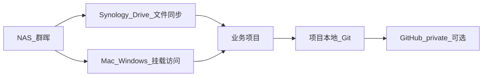

# NAS / Drive 存储策略

## 总体原则

- NAS 负责文件存放、同步、备份
- GitHub private repo 负责代码和 Agent 上下文主线
- Cursor/Codex 负责执行
- `ide-toolbox`（IDE Toolbox）负责项目创建与治理

## 共享文件夹语义

| 位置 | 用途 | 是否放项目 |
|---|---|---|
| `Download` | 临时下载中转 | 否 |
| `home/Photos`、`photo` | 照片库 | 否 |
| `media`、`video` | 影音内容 | 否 |
| `home/Backup` | 设备/Drive 备份 | 否 |
| `home/Drive/00_FileStation` | 活动项目工作台 | 是 |
| `home/Drive/01_Project Files` | 项目库/归档区 | 是（冷项目） |
| `home/Drive/02_Resources Files` | 资源库 | 否（资料） |
| `home/Drive/03_Study Files` | 学习资料 | 否（学习） |
| `home/Drive/00_FileStation/ide-toolbox` | 项目自动化工具箱（IDE Toolbox） | 否（管理） |

## 项目生命周期

1. 在 `ide-toolbox`（IDE Toolbox）运行 `./ide` 或 `scripts/new-ai-project.sh`
2. 项目创建到 `00_FileStation/YYMMDD-slug`
3. 自动注入 Cursor/Codex 模板
4. 视需要初始化 Git / GitHub private repo
5. 项目不活跃后归档到 `01_Project Files/99_归档`

## 命名建议

- 推荐：`YYMMDD-slug`
- 示例：`260614-cursor-codex-workflow`
- 代码项目优先英文 slug，跨 Windows/macOS/GitHub 更稳

## 不建议做的事

- 不要把 Cursor/Codex 内部聊天数据库当项目记忆
- 不要频繁在活动区和归档区来回搬项目
- 不要把密钥、证件、cookie、token 放进 Git
- 不要把 Synology Drive 当成 Git 替代品

## 多端路径对照（群晖 / Mac / Windows）

同一套文件在每台设备上**路径不同，但逻辑位置相同**。不要记绝对路径，记「逻辑位置 + 设备别名」。

### 逻辑位置一览

| 逻辑位置 | 群晖 NAS 真实路径 | 用途 |
|---|---|---|
| 活动项目区 | `home/Drive/00_FileStation/` | 正在做的项目 |
| 工具箱 | `home/Drive/00_FileStation/ide-toolbox/` | 项目治理（本目录） |
| 归档区 | `home/Drive/01_Project Files/99_归档/` | 不活跃项目 |
| 资源库 | `home/Drive/02_Resources Files/` | 参考资料，非项目 |
| 学习资料 | `home/Drive/03_Study Files/` | 学习材料，非项目 |

### 各设备上的访问路径

| 逻辑位置 | MacBook / Mac mini（NAS 挂载） | MacBook（Synology Drive 同步） | Windows（Git Bash，示例） |
|---|---|---|---|
| 活动项目区 | `/Volumes/home/Drive/00_FileStation` | `~/Library/CloudStorage/SynologyDrive-FileStation` | `Z:/Drive/00_FileStation`（待你填写） |
| 工具箱 | `/Volumes/home/Drive/00_FileStation/ide-toolbox` | `~/Library/CloudStorage/SynologyDrive-FileStation/ide-toolbox` | `Z:/Drive/00_FileStation/ide-toolbox` |
| 归档区 | `/Volumes/home/Drive/01_Project Files` | `~/Library/CloudStorage/SynologyDrive-FileStation/../01_Project Files`* | `Z:/Drive/01_Project Files` |

\* Mac 上 Synology Drive 同步目录通常只同步 `00_FileStation` 等工作区；归档区更常用 NAS 挂载路径访问。以你 NAS 实际同步范围为准。

### 两种 Mac 访问方式怎么选

| 方式 | 路径示例 | 适合场景 |
|---|---|---|
| **NAS 挂载**（SMB） | `/Volumes/home/Drive/...` | 脚本默认优先；Mac mini 局域网内推荐 |
| **Synology Drive 同步** | `~/Library/CloudStorage/SynologyDrive-FileStation/...` | MacBook 离线/外出；与 Cursor 集成的同步视图 |

工具箱脚本（`lib.sh` → `resolve_active_dir`）的查找顺序：

1. `config/project-policy.yaml` 里当前设备的 `active_projects`
2. NAS 挂载路径（`/Volumes/home/Drive/00_FileStation`）
3. Cursor 同步路径（`~/Library/CloudStorage/SynologyDrive-FileStation`）

**结论：** 两台 Mac 可以一个用挂载、一个用同步，看到的是同一批项目文件。

### Windows 说明

- 统一使用 **Git Bash**，不做 PowerShell 版
- 在 `config/project-policy.yaml` → `devices.windows` 填写映射盘路径
- 映射盘符取决于你在 Windows 上如何挂载群晖共享文件夹（常见 `Z:`，以实际为准）

```yaml
devices:
  windows:
    shell: git-bash
    active_projects: "Z:/Drive/00_FileStation"
    toolbox: "Z:/Drive/00_FileStation/ide-toolbox"
```

Git Bash 内路径写法示例：`cd "/z/Drive/00_FileStation/ide-toolbox"`

### 同步 vs Git 的分工



| 载体 | 同步什么 | 不是什么 |
|---|---|---|
| Synology Drive / NAS 挂载 | 项目文件、文档、脚本 | Git 替代品 |
| 项目内 Git | 代码、规则、Agent 上下文版本 | 聊天记录备份 |
| GitHub private | 跨设备 Git 主线 | 大文件/证件仓库 |

### 项目文件落在哪

- **新建项目** → 始终在逻辑「活动项目区」：`00_FileStation/YYMMDD-slug/`
- **不管你在哪台设备**，脚本都往同一逻辑位置写
- **设备差异**只体现在「你怎么打开这个目录」（挂载路径 vs 同步路径 vs 映射盘）
- 每台设备的具体路径登记在项目的 `docs/devices.md`（通过 `./ide` → 登记当前设备）

## 多端路径（速查）

- NAS 活动目录：`/Volumes/home/Drive/00_FileStation`
- Cursor 同步视图：`/Users/dawncity/Library/CloudStorage/SynologyDrive-FileStation`
- 归档目录：`/Volumes/home/Drive/01_Project Files`
- Windows：在 `config/project-policy.yaml` 的 `devices.windows` 填写 Git Bash 使用的映射盘路径

## 设备概念

- **设备接入检查**：当前这台设备的环境自检（git、gh、路径、工具箱）
- **项目设备登记**：项目内 `docs/devices.md` 记录哪些设备在使用该项目

这不是 Git 被哪些设备 pull 过的列表。

## 相关文档

- [docs/README.md](docs/README.md)
- [docs/architecture.md](docs/architecture.md)
- [docs/onboarding.md](docs/onboarding.md)

## 旧项目策略

- 从今天开始，新项目按本策略创建
- 旧项目只在再次激活时用 `upgrade-ai-project.sh` 升级
- 不建议现在大规模搬迁旧目录
